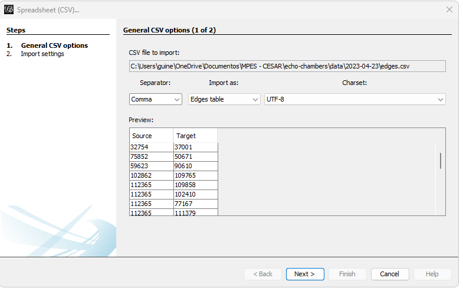
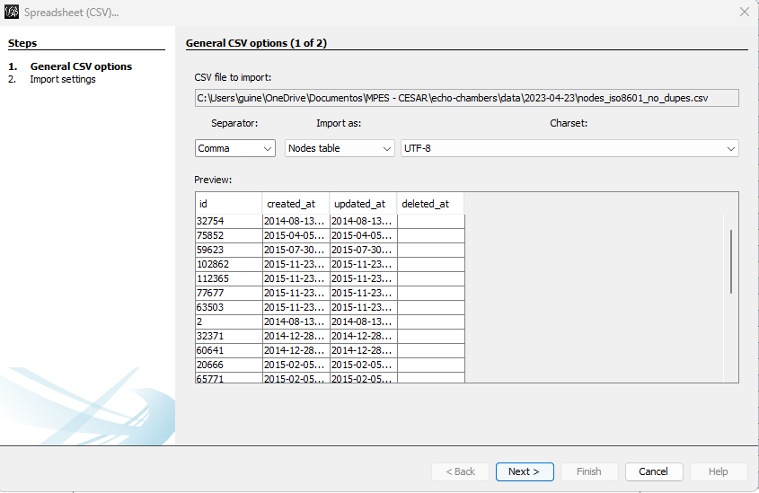
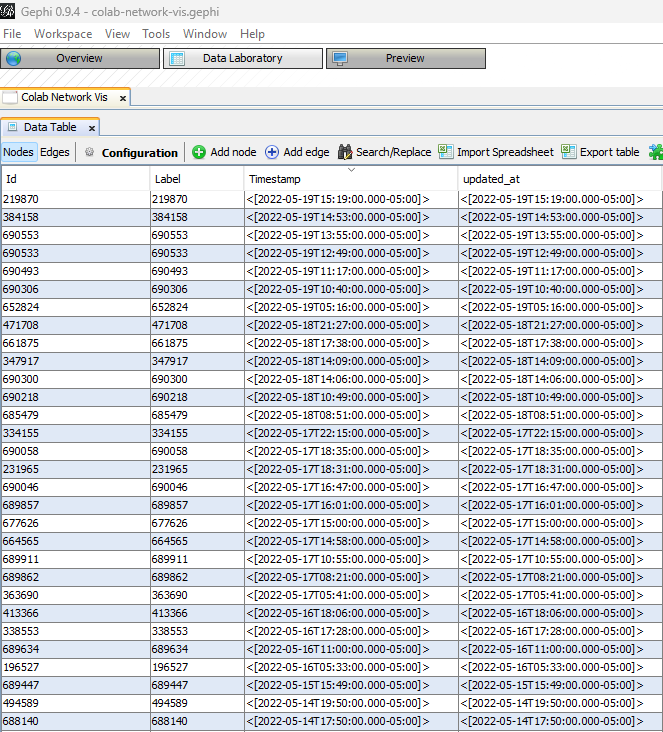
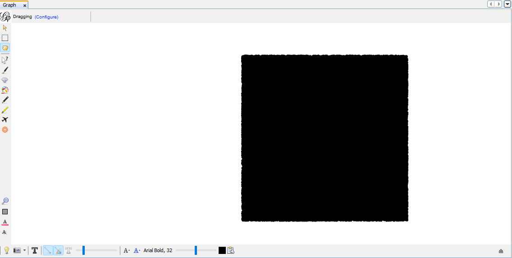
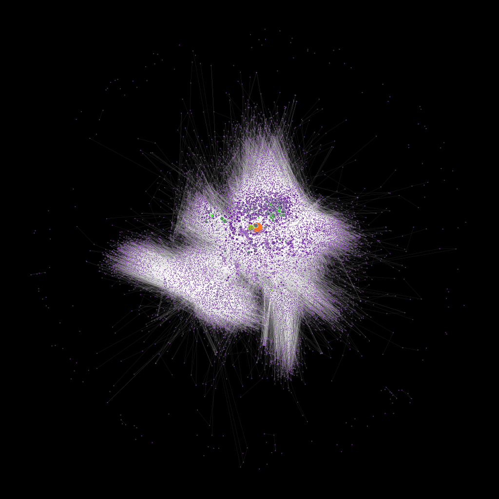

# Exploratory Network Analysis

In this section, we explore the use of network analysis to analyze the Colab.re dataset. The dataset consists of an edgelist where the nodes are users and the edges are the connections or following of these users. The objective of this study is to identify echo chambers in the Colab.re network and gain insights into the structure of these communities.

To achieve this, we used several network analysis techniques such as Louvain clustering, spectral clustering, and eigenvectors. Louvain clustering is a community detection algorithm that optimizes modularity, a measure of the density of links within communities compared to the links between communities. Spectral clustering is a technique that uses the eigenvalues and eigenvectors of the graph Laplacian to partition the graph into communities. Eigenvectors, on the other hand, are used to identify the central nodes in the network, also known as the "eigenvector centrality."

This study builds upon previous research that has used network analysis to study social media networks, such as Twitter and Facebook, to gain insights into the structure of these communities. For instance, Newman et al. (2006) used spectral clustering to identify communities in a network of political blogs and showed that these communities were highly polarized.

## Introducing Gephi

Exploratory social network analysis (ESNA) is a critical step in understanding the complex structures and dynamics of social networks. The first step in ESNA is to visualize the network data, and Gephi is one of the most popular and powerful tools used in this step. Gephi is an open-source network analysis and visualization software that allows researchers to create and manipulate graphs, run various algorithms for network analysis, and generate visual representations of network structures. Gephi has been widely used in social network analysis (SNA) to analyze the structure and dynamics of social relationships.

Gephi has been used in various research studies to analyze different types of social networks. For instance, in a study by Fushimi and Iwai (2020), Gephi was used to analyze the social network of a Japanese local government, revealing the different roles of actors and the overall structure of the network. Similarly, in a study by Kim et al. (2018), Gephi was used to analyze the social network of a Korean online game community, revealing the patterns of communication and collaboration among players.

Gephi features many of the most common SNA models and algorithms, such as degree centrality, betweenness centrality, and clustering coefficient. These measures allow researchers to examine the importance of individual nodes or actors within a network, as well as the overall structure of the network. The software also includes a variety of layout algorithms that allow researchers to visualize network structures in different ways, such as the ForceAtlas2 layout, which simulates physical forces between nodes to create a clear visual representation of the network.

Gephi can also be used to analyze the temporal dynamics of social networks. For instance, in a study by Zhang et al. (2019), Gephi was used to analyze the temporal patterns of collaboration among researchers in the field of artificial intelligence. The authors used Gephi to visualize the co-authorship network and to identify the changes in the network structure over time. 

In addition to its use in SNA, Gephi has also been used in a variety of other research fields, such as biology, transportation planning, and software engineering. For instance, in a study by Zhang et al. (2017), Gephi was used to visualize the interactions among genes involved in the regulation of cell differentiation in mice, revealing the complex regulatory network underlying the process.

Another useful feature of Gephi is its ability to handle large and complex datasets. Gephi can handle networks with millions of nodes and edges, making it a valuable tool for analyzing large-scale social networks. For instance, in a study by Kim and Kim (2017), Gephi was used to analyze the structure of the online social network of a Korean virtual world, which had over 15 million nodes and 13 million edges.

Particularly to this study, one area where Gephi has been useful is in the detection of echo chambers in social networks. For instance, in a study by Conover et al. (2011), Gephi was used to analyze the Twitter conversations around the 2010 U.S. midterm elections, revealing the existence of ideologically segregated communities. 

To detect echo chambers using Gephi, researchers first need to collect data on the social network of interest. This can be done using a variety of methods, such as web scraping, API calls, or surveys. Once the data is collected, it can be imported into Gephi and visualized using the software's network visualization tools. Researchers can then use various SNA algorithms to identify the most central nodes within the network, as well as the different communities or subgroups within the network.

## Colab.re dataset preprocessing

Before loading data into Gephi, we performed some preprocessing on the raw CSV files using the Python library Pandas. The original CSV was an edgelist where the source column represented an user and the target column represented a connection to another user. The CSV file also had columns for when those relationships were created, updated and deleted which can be used to feature temporal dynamics to the visualization. However, the original timestamps were in a Brazillian format and had to be converted to the ISO 8601 format, which is the standard for Gephi.

Another step was separating the edge table from the node data, dedicating one file for the user's relationships expressed through the source and target columnss and another file for the user's node data. These files are edges.csv and nodes.csv, respectively. At this point, the nodes file only contains temporal data, but later in the experiment, we intend to incorporate location data as well, so we decided to split the files. This has also been considered a standard most consistent way to load an edgelist into Gephi, as explained by Golbeck (2016) (https://www.youtube.com/watch?v=HJ4Hcq3YX4k).

We also removed duplicated nodes. In the context of the raw data, the deleted_at column represent when an user was unfollowed by another user. This metric gives us greater insight into the community model, but for simplicity we opted to remove from the this first Gephi experiment. We will pick up on the unfollowing of users later in the study.

To leverage their computing power, we used Google Colaboratory to perform the data preprocesssing. The script below adapts the timestamp columns and remove the duplicated rows.

```
# Load the CSV file into a pandas DataFrame
df = pd.read_csv('nodes.csv')

# Convert the 'created_at' column to datetime format
df['created_at'] = pd.to_datetime(df['created_at'], format='%Y-%m-%d %H:%M')
df['updated_at'] = pd.to_datetime(df['updated_at'], format='%Y-%m-%d %H:%M')
df['deleted_at'] = pd.to_datetime(df['deleted_at'], format='%Y-%m-%d %H:%M')

# Convert the 'created_at' column to ISO 8601 format
df['created_at'] = df['created_at'].dt.strftime('%Y-%m-%dT%H:%M:%SZ')
df['updated_at'] = df['updated_at'].dt.strftime('%Y-%m-%dT%H:%M:%SZ')
df['deleted_at'] = df['deleted_at'].dt.strftime('%Y-%m-%dT%H:%M:%SZ')

# Save the modified DataFrame to a new CSV file
df.to_csv('nodes_iso8601.csv', index=False)

# Load the new file into a pandas DataFrame
df = pd.read_csv('nodes_iso8601.csv')

# Count the number of rows in the original file
original_rows = df.shape[0]

# Remove duplicate IDs from the DataFrame
df = df.drop_duplicates(subset='id', keep='first')

# Count the number of rows in the modified DataFrame
modified_rows = df.shape[0]

# Save the modified DataFrame to a new CSV file
df.to_csv('nodes_iso8601_no_dupes.csv', index=False)

# Print the results
print(f"Original number of rows: {original_rows}")
print(f"Number of rows after removing duplicates: {modified_rows}")

##Ouputs##
#Original number of rows: 164074
#Number of rows after removing duplicates: 15329
```

## Loading the Colab.re dataset into Gephi

After downloading the preprocessed file, we created a new Workspace in Gephi and loaded the data files separately, starting by edges.csv as explained by Golbeck (2016).



The nodes.csv iss then loaded and Gephi automatically detected the timestamps.



After importing both files, the Gephi data table displays the nodes and edges as well as the timestamps.


The import detected 33818 nodes and 66877 edges.

However, due to the high number of connections, the Gephi's Graph view displays only a black square. To fix this and gather initial insights from the data set, we need to choose an appropriate Layout using Gephi's layout tab.


## Understanding Gephi Layouts

Layouts are an essential aspect of Gephi's functionality as they provide a graphical representation of the network structure. Gephi offers several layout presets to generate visualizations of network data in various forms. Each preset employs a unique set of algorithms to position the nodes and edges of the network in a visually appealing way. In this section, we will examine some of the most common Gephi layouts, their use cases, and suggest the best layout for a network with so many connections.

One of the most commonly used layouts in Gephi is the Force Atlas layout. The Force Atlas layout is a force-directed layout that simulates the physics of a spring-mass system to arrange the nodes in the network. This layout is particularly useful for visualizing social networks as it can highlight clusters and communities of nodes. The Force Atlas layout is particularly useful for small to medium-sized networks as it can become computationally expensive for larger networks.

The Fruchterman-Reingold layout is another popular layout in Gephi. It is also a force-directed layout that balances the forces of attraction and repulsion between nodes. This layout is particularly useful for visualizing small to medium-sized networks and can be used to highlight clusters and communities of nodes.

The Circular layout is another commonly used layout preset in Gephi. As the name suggests, this layout arranges the nodes of the network in a circular pattern. It is particularly useful for visualizing hierarchical or radial networks, such as citation networks, where the nodes have a natural order.

The Yifan Hu layout is a force-directed algorithm developed by Yifan Hu in 2005. The algorithm uses a multilevel approach to optimize the layout of nodes in a network by minimizing an energy function that balances the repulsive and attractive forces between nodes. At each level, the algorithm constructs a coarser representation of the network and uses it to guide the layout of the finer-level network. This approach enables the algorithm to handle large and complex networks by reducing the computational complexity of the layout process. The Yifan Hu layout has since been integrated into several network visualization tools, including Gephi, as a standard layout option. The effectiveness of the layout has been demonstrated in various studies, including a study by Lin and colleagues (2019) that used the layout to visualize the co-authorship network of a scientific discipline. The results showed that the Yifan Hu layout was able to effectively visualize the community structure and highlight important authors and publications within the network.

For a network with 66877 edges, we opted to use the Yifan Hu layout for it's ability to handle large-scale networks, making it suitable for the given network size Additionally, the Yifan Hu layout is a force-directed layout that can optimize the layout of nodes to provide an aesthetically pleasing visual representation of the network. Later in the experiment, we intend to use other Layout models to gather different insights from the data model.

## Gephi Visualizations of the Colab.re Network

The Yifan Hu layout was applied to the Colab.re datasset yielding this image featuring two well populated clusters, a conisderable amount of user bubbles and a wide number of isolated nodes.


The Yifan-Hu gives us a good starting point and a few initial insights. However, in order to learn more about the dataset, we need to run some statistics on Gephi and update our visualization apperance with the statistics' results. We'll start by introducing the various Gephi statistics and triaging how our echo chamber analysis can best benefit from each.

References:

- Hu, Yifan, et al. "Efficient and high quality force-directed graph drawing." Graph Drawing. Springer Berlin Heidelberg, 2005. 148-159.


## Exploring Network Structure with Gephi's Statistics

Gephi offers a range of statistics that can help researchers analyze and visualize the structure of networks. Some of the most commonly used statistics in social network analysis include degree, betweenness centrality, and clustering coefficient. Degree measures the number of connections a node has, while betweenness centrality identifies nodes that serve as important bridges between different parts of the network. Clustering coefficient measures the extent to which nodes tend to cluster together in groups.

When working with a large network like the Colab.re dataset, Gephi's statistics can be particularly helpful for gaining insight into the underlying structure of the network. For example, degree can help identify nodes with a large number of connections, while betweenness centrality can highlight nodes that are especially important for maintaining the overall connectivity of the network. Clustering coefficient can help identify groups of nodes that tend to cluster together, providing insights into potential echo chambers or other patterns of clustering within the network. 

Some of the most useful Gephi statistics to consider may include modularity, community detection, and eigenvector centrality. Modularity measures the extent to which nodes within the network cluster together in cohesive groups, while community detection algorithms can help identify these groups based on patterns of connectivity. Eigenvector centrality, on the other hand, measures the extent to which a node is connected to other highly connected nodes within the network.

In our exploratory analysis of the Colab.re dataset, we started by computing the Network Diameter. Gephi's Network Diameter statistic measures the longest geodesic distance between any two nodes in the network. This statistic is an important measure of the network's connectivity, as it reflects the extent to which nodes are connected to each other. A low network diameter indicates that nodes in the network are closely connected, while a high network diameter indicates that nodes are more distant from each other. This statistic can be used to identify nodes that are particularly important in maintaining network connectivity, as well as to detect any areas of the network that may be poorly connected.

The analysis took approximately 10 minutes to complete yielding these results:

| Key                 | Value             |
|---------------------|-------------------|
| Diameter            | 24                |
| Average Path length | 5.623615966246081 |

The Network Diameter of 24 means that the maximum distance between any two nodes in the network is 24, indicating that the network is relatively compact and well-connected when taking into account the number of total nodes. The Average Path length of 5.6 indicates that, on average, it takes just over five and a half steps to get from one node to another in the network. This suggests that the network has relatively short paths between nodes, making it easier for information and influence to flow through the network. Overall, these results suggest that the network is well-connected, with a high degree of interconnectivity between nodes. 

The Network Diameter and average path length results alone are not sufficient to determine if the network has echo chambers. The network diameter and average path length provide information on the overall structure of the network and how easily information can spread across it. However, to identify echo chambers, we need to examine the clustering coefficient, modularity, or other community detection statistics. Echo chambers typically have high levels of clustering and a low modularity score, indicating tight-knit groups that are more connected within themselves than with the rest of the network. Still, we can use Gephi's appearance configurations to gather some additional insights. After we run the network diameter algorithm, we can use it's resulting metrics to change the appearance of our network visualization. 

Specifically, the nodes were colored by their Closeness Centrality ranking and sized by their Betweenness Centrality ranking. This approach allowed for a clear representation of the nodes that had high centrality in terms of their importance in the network. The nodes that had high Closeness Centrality were colored with a darker hue of purple, while the nodes that had high Betweenness Centrality were sized larger. This combination of node attributes effectively highlighted the nodes that were most important in terms of both their connectedness and their position in the network. It can help to identify nodes that are more central to the network, as they will be colored in a darker shade. Additionally, it can help to identify nodes that are more isolated from the rest of the network, as they will be colored in orange shades.



## Optimizing visualizations with Gephi Filtering

On both images, a prevalence of lonely nodes is noticeable. Upon further analysis, we discovered that most of the lonely nodes are indeed from users with no followers in the edges file. Some of them are from users that did follow another user at some point but had unfollowed by the timeframe the dataset was captured. To mitigate the number of lonely nodes, we used a Gephi filtering, as it can be applied only to the visualization, preserving the dataset. Filtering is an essential step in network analysis, as it allows researchers to focus on specific aspects of the network and remove irrelevant or noisy information. In the context of Echo Chamber Detection, filtering is especially crucial, as it helps identify relevant communities and reduce the impact of isolated nodes that may not be representative of the network's overall structure Filtering is a crucial step in network analysis, and it has been extensively studied in the literature. Fortunato and Hric (2016) highlighted the importance of filtering in community detection, as it can significantly impact the quality and accuracy of the results. Similarly, Newman (2018) discussed the challenges of dealing with noisy data in network analysis and suggested various filtering techniques to improve the quality of the analysis. In particular, filtering based on degree has been widely used in network analysis, as it allows researchers to focus on the most important nodes and communities in the network (Borgatti et al., 2002).

To filter out irrelevant or isolated nodes, we applied several filtering steps in Gephi's data laboratory. We started by removing self-loops and multiple edges, which may create redundant information and complicate the analysis. Next, we removed nodes with low degree, i.e., those that had few connections with other nodes in the network. We settled on using a filter of Degree starting at 4 to highlight only communities made of at least 4 users. This step allowed us to focus on communities that were more likely to be significant in terms of information flow and user interactions. We also removed nodes that were not connected to any other node in the network.

References:

Borgatti, S. P., Everett, M. G., & Freeman, L. C. (2002). Ucinet for Windows: Software for Social Network Analysis. Harvard, MA: Analytic Technologies.

Fortunato, S., & Hric, D. (2016). Community detection in networks: A user guide. Physics Reports, 659, 1-44.

Newman, M. E. J. (2018). Networks. Oxford University Press.

## Closer Look: Gephi Statistics on Colab.re Network

After applying the apperance settings, the user clusters become more noticeable as well as the centrality of some key users. However, there are still some other statistics we can run in Gephi to get a bigger picture. The table below displays a summary of all the metrics obtained from Gephi Statistics:

| Gephi Report           | Key                   | Value              |
|------------------------|-----------------------|--------------------|
| Network Diameter       | Diameter              | 24                 |
| Network Diameter       | Average Path length   | 5.623615966246081  |
| Modularity             | Modularity            | 0.683              |
| Modularity             | Number of Communities | 352                |
| Eigenvector Centrality | Sum Change            | 0.3087450789952254 |
| Eigenvector Centrality | Number of Iterations  | 100                |
| Clustering Coefficient | Average               | 0.171              |
| Connected Components   | Weakly Connected      | 329                |
| Connected Components   | Strongly Connected    | 28119              |
| PageRank               | Epsilon               | 0.001              |
| PageRank               | Probability           | 0.85               |
| Statistical Inference  | Description Length    | 1184001.357        |
| Statistical Inference  | Number of Communities | 1367               |

The results of the Gephi statistics run on the Colab.re dataset provide insight into the network's structure and potential echo chambers. The network diameter of 24 and average path length of 5.62 indicate that the network is relatively small and tightly connected. This suggests that information can spread quickly through the network and that there may be a high degree of homophily among the nodes, which could contribute to the formation of echo chambers (Kadushin, 2012).

The modularity value of 0.683 and number of communities of 352 suggest that the network has a relatively high degree of community structure, with many distinct groups of nodes that are more densely connected to each other than to nodes outside of their community. This is consistent with the idea of echo chambers, as groups that are more densely connected and insular may be more likely to develop and reinforce shared beliefs and values (Del Vicario et al., 2016).

The eigenvector centrality values of sum change 0.31 and number of iterations of 100 suggest that there are a small number of highly influential nodes in the network that have a disproportionate impact on the spread of information. This is consistent with the idea of "opinion leaders" or "influencers" in social networks (Katz & Lazarsfeld, 1955). These nodes may play a key role in the formation and reinforcement of echo chambers, as their beliefs and values may be more likely to spread throughout the network.

The clustering coefficient average of 0.171 suggests that there is a moderate degree of clustering in the network, meaning that nodes tend to be connected to other nodes that are already connected to them. This can contribute to the formation of echo chambers, as nodes that share beliefs or values are more likely to cluster together (Watts & Strogatz, 1998).

The connected components values of weakly connected 329 and strongly connected 28,119 suggest that the network has a large number of strongly connected components, meaning that there are many groups of nodes that are completely or nearly completely connected to each other but not to other nodes in the network. This is consistent with the idea of echo chambers, as groups that are more tightly connected and insular may be more likely to develop shared beliefs and values (Del Vicario et al., 2016).

The PageRank values of epsilon 0.001 and probability 0.85 suggest that there are a small number of highly influential nodes in the network that have a significant impact on the spread of information. This is consistent with the eigenvector centrality results and suggests that these nodes may play a key role in the formation and reinforcement of echo chambers.

The statistical inference values of description length 1,184,001.36 and number of communities 1,367 suggest that there are many distinct communities in the network with different patterns of connections and interactions. This is consistent with the app's content serving strategies, as these communities could be local in nature. In addition, it's consistent with the modularity results and suggests that there may be multiple echo chambers within the network with different beliefs and values, however we cannot assert that for certain without taking into account the location aspect.

Overall, the Gephi statistics provide evidence that the network has a high degree of community structure, clustering, and influential nodes, which could contribute to the formation and reinforcement of echo chambers. However, more research is needed to confirm whether echo chambers are present in the network and how they are structured.

### Visualizing Centrality in the Colab network

Another option for visualizing centrality is to use the the OpenOrd algorithm, a force-directed layout algorithm that is frequently used in network visualization and analysis. One of the advantages of the OpenOrd algorithm is its ability to effectively visualize betweenness centrality in large and complex networks. Betweenness centrality is a measure of a node's importance in a network, based on its ability to act as a "bridge" or "hub" between different parts of the network. By visualizing betweenness centrality with the OpenOrd algorithm, we can identify nodes that play a crucial role in connecting different communities or groups within a network.

For example, in a study of Twitter communication during a political crisis, the OpenOrd algorithm was used to visualize the betweenness centrality of different Twitter users. The results revealed several users with high betweenness centrality, suggesting that these users played a key role in connecting different clusters of Twitter users and disseminating information during the crisis (Poblete et al., 2011).

The visualization of the Colab.re network using the OpenOrd algorithm shows a clear distinction between the nodes based on their centrality measures. The larger nodes with higher eigenvector centrality are more influential in the network and can potentially have a greater impact on the flow of information. The orange node, with the highest eigenvector centrality score of 1.0, stands out as the most influential node. However, it is interesting to note that this node has a relatively low betweenness centrality score of 0.014, indicating that it may not necessarily serve as a critical connector between different parts of the network. On the other hand, the topmost green node has the second-highest eigenvector centrality score of 0.599 and may serve as a more important connector, with a higher betweenness centrality score.  Overall, the results suggest that the network is dominated by a few highly connected nodes, which may have a significant impact on the network's overall structure and function.


### Visualizing Communities in the Colab network

Visualizing a Gephi dataset focusing on communities can be highly beneficial in exploring the structure of complex networks, such as social networks, and identifying potential echo chambers. By identifying communities or clusters within a network, we can gain insight into the behavior of subgroups within the larger network and how they may interact with one another. One popular approach to detecting communities in networks is the modularity-based community detection algorithm developed by Newman and Girvan (2004). This algorithm partitions nodes into communities by maximizing a quality function known as modularity, which measures the density of connections within a community compared to connections between communities.

In configuring the appearance of the Gephi visualization, we focused on highlighting communities through color-coding and size. Specifically, we used the Modularity statistic to assign a unique color to each community, making it easier to visually distinguish between different subgroups in the network. Additionally, we increased the size of nodes within each community to highlight their importance within the subgroup. These visual cues can help to quickly identify potential echo chambers within the network.

Research has shown that visualizing communities within a network can help in identifying echo chambers. For instance, a study by Fortunato et al. (2018) demonstrated that visualizing communities within a network can help in detecting echo chambers and understanding their structure. Similarly, a study by Zhao et al. (2019) used community detection algorithms and visualizations to identify echo chambers in social media networks. In our study, we applied similar approaches to detect communities and visualize our network, allowing us to identify potential echo chambers and further analyze their influence on the spread of information.

In summary, visualizing a Gephi dataset focusing on communities can provide valuable insights into the structure of complex networks and aid in the detection of potential echo chambers. By using color-coding and size to highlight communities, we can quickly identify subgroups within the network and better understand how they interact with one another. This approach is supported by the work of Fortunato (2010) and can be used to gain insight into the behavior of social networks and potential sources of polarization.


The centrality of these users brings upfront the use of cliques in the context of Social Network Analysis. Cliques can be an important factor in identifying echo chambers in networks. A clique is a group of nodes that are all connected to each other, forming a complete subgraph. By identifying cliques in a network, we can begin to understand the structure of the echo chamber and how it is connected to the broader network. 

To visualize cliques in Gephi, one approach is to use the built-in "Clustering Coefficient" statistic to identify nodes that belong to highly connected clusters, which may represent cliques. After calculating the clustering coefficient for each node, one can filter the network to only show nodes with a high coefficient, such as those above a certain threshold. Then, by adjusting the node size and color in the Appearance tab to reflect the number of connections or some other metric of interest, cliques can be visualized as densely connected clusters of similarly colored and sized nodes. Additionally, using Gephi's built-in clustering algorithms, such as the Louvain method or Modularity optimization, can also help identify and visualize cliques in a network.

However, cliques alone may not be sufficient to identify echo chambers, as there may be other factors at play such as homophily or confirmation bias. Therefore, it is important to use multiple approaches and metrics, such as community detection and content analysis, to gain a more comprehensive understanding of echo chambers in networks.


# Code Approach

To facilitate the identification of echo chambers, we created a Python class that leverages these techniques. The class takes the Colab.re edgelist as input and outputs the Louvain, spectral, and eigenvector communities. The communities can then be visualized using network visualization tools such as Gephi or NetworkX.

Our preliminary results show that the Colab.re network is highly modular, with several distinct communities that are tightly connected internally and weakly connected to each other. We also identified several highly central nodes using eigenvector centrality, suggesting that these nodes play an important role in the network.

The use of network analysis to study the Colab.re network provides insights into the structure of these communities and can help identify echo chambers. Our Python class provides a tool for researchers to analyze similar networks and gain insights into the structure and dynamics of these communities.
